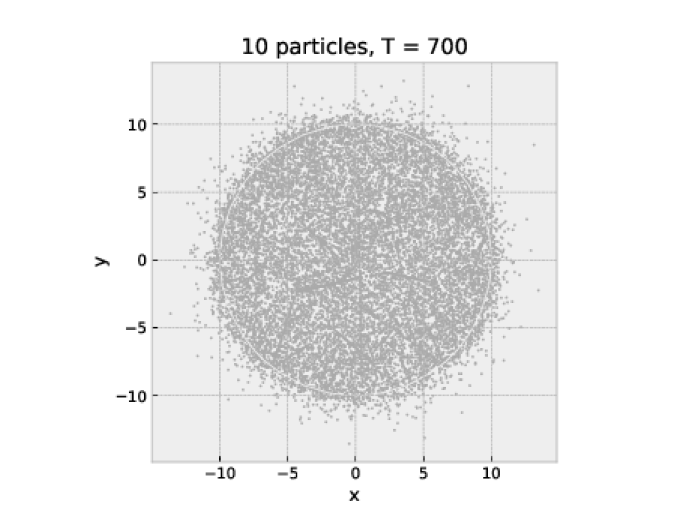

# Simulation of 2D gas using Verlet method

The report itself is located in the `report` directory.
All relevant graphcis is in the `report/media` directory.

The code is distrubuted on several files, `utils.jl` being the main base of the code.
The rest of the files import functions from there.
